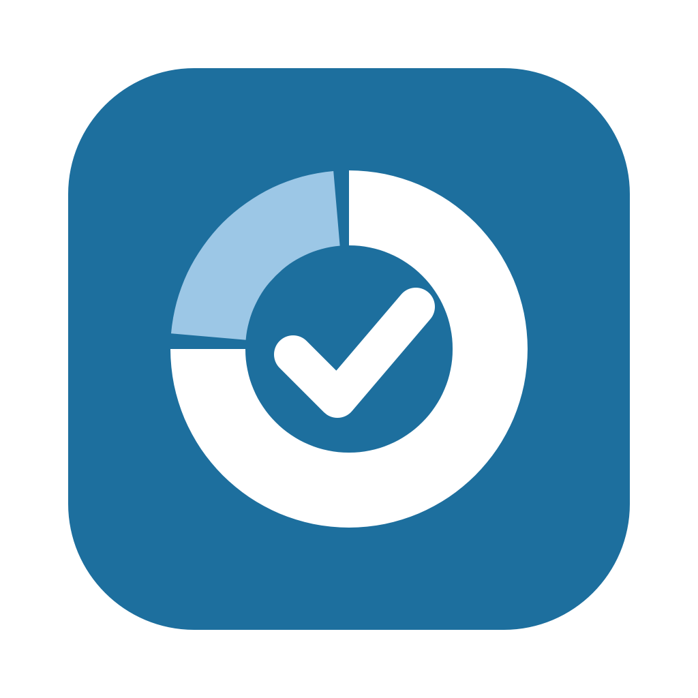

# Test Tracker

A desktop dashboard for software release testing. It reads the team's test-tracking
**Google Sheet**, shows where testing stands at a glance, and lets you update cells, which
are written straight back to the sheet.



## Features

- **Dashboard** with a card per tab (percent done, with a bar split by status) and, for each
  tab:
  - a **status donut** with counts and percentages
  - **status by group** bars, e.g. by *System in Formal Test*, *Assignee*, *Equipment*, or
    *Workflow Type*
  - **runs per day**, for tabs with a date column
  - Hover over any chart for details. **Click a slice or bar** to jump to exactly those rows
- **One tab per sheet tab**, with:
  - **Search** across every column
  - **Filters** for dropdown and grouping columns (*Status ▾*, *Equipment ▾*…). Tick the values
    to show
  - **Sorting**: click a column header, and click again to reverse. Status sorts by
    progress, dates sort by date, and ticket numbers sort as numbers (PROD-2 before PROD-10)
  - **Show empty rows** to reveal placeholder rows (e.g. run numbers with nothing filled in yet)
- **Edit in the app, saved to the sheet**: double-click a cell.
  - Dropdown columns show the sheet's own dropdown options, with *Select several…* for
    multi-select cells like `SMOKE, DRY`
  - Date columns get a calendar
  - Link cells (PROD tickets, run links) open on double-click. Change their text or URL with
    **Edit cell…** or by right-clicking
  - Notes open in a larger text box
- **+ Add row**: a form with the right control for each column. On run trackers it
  suggests the next run number, and fills the empty placeholder row for that number if
  there is one
- **Safe with several people editing**: before saving, the app checks that the cell still
  holds what you saw. If someone changed it meanwhile, it asks before replacing it. If rows
  were added or moved, it still finds the right row
- **Syncs every minute** (or click **↻ Sync**, ⌘R). If the connection drops, it keeps
  showing the last synced data
- **One-click updates**: a **⬆ Update** button appears when a new version is released

## How it adapts to new releases

Nothing about a particular release is built into the app. It reads the sheet's structure
every time it syncs:

- **Every visible tab** becomes a tab in the app. **Hidden tabs are ignored.**
- If a tab is a Google Sheets **Table** (*Format → Convert to table*), the app uses the
  table's **column types**: dropdown options become dropdowns, and date columns become date
  pickers. On plain tabs, the first row is the header, and dropdowns come from data
  validation.
- The **status column** is the dropdown whose name contains "Status" (e.g. *Current
  Status*, *Atlantis Status*). Charts are grouped by the other dropdowns and by short text
  columns that repeat, like *System* or *Assignee*.
- Status colors follow meaning: *Completed / Done / Results* are green, *In Progress*
  blue, *Blocked / Error* red, *Cancelled* orange, *No results* yellow, *Not Started /
  Created* gray, and *Deferred* dark gray.
- Tabs whose name contains **"Automated"** (filled in from Jira) are read-only in the app.

**To start a new release**, do either of these:

1. **New sheet file**: in Google Sheets, *File → Make a copy* (tick *Share it with the same
   people*, so the robot account keeps access), rename it (e.g. *v4.22 Test Tracker*), and
   clear out the old rows. In the app, pick **+ Add another release…** from the **Release**
   dropdown and paste the link. You can switch between releases from that dropdown.
2. **New tab in the same file**: duplicate a tab and rename it. It shows up by itself on the
   next sync.

## Install

**On any Apple Silicon Mac**, paste this into Terminal:

```bash
curl -fsSL https://raw.githubusercontent.com/shivthakar-vital/test-tracking/main/install.sh | bash
```

See **[INSTALL.md](INSTALL.md)** for step-by-step instructions to share with coworkers.

### Building it yourself

`./build_mac.sh --install` builds `Test Tracker.app` from source and copies it to
`/Applications`. Drop `--install` to only build into `dist/`.

To publish a new version for everyone, bump `APP_VERSION` at the top of `test_tracker.py`,
commit, and push a matching tag (e.g. `v1.0.1`). GitHub Actions checks that the two match,
builds the app, and attaches it to a GitHub Release. The install line downloads it, and the
app's **⬆ Update** button installs it.

**Windows:** run `build_windows.bat` on a Windows PC with Python 3. The app ends up in
`dist\Test Tracker\Test Tracker.exe`.

**Run from source (for development):**

```bash
python3 -m venv .venv && .venv/bin/pip install -r requirements.txt
.venv/bin/python test_tracker.py
```

## Connect a Google Sheet

The app signs in to Google with a *service account*: a robot Google account that you share
the sheet with. It uses the same kind of key as Qave Inventory. **If Qave Inventory is set
up on this Mac, Test Tracker reuses its key automatically.**

To set up a new one (about 10 minutes):

1. **Create a Google Cloud project** at <https://console.cloud.google.com/>.
2. **Enable the API**: *APIs & Services → Library*, search for **Google Sheets API**, and
   click **Enable**.
3. **Create the service account**: *APIs & Services → Credentials → Create credentials →
   Service account*. Name it and click **Done**.
4. **Download a key**: click the service account, then *Keys → Add key → Create new key →
   JSON*. Keep the file private.
5. **Share the sheet** with the service account's email (e.g.
   `inventory-bot@qave-inventory.iam.gserviceaccount.com`) as an **Editor**.
6. **Configure the app**: click **⚙ Settings**, paste the sheet link, click **Add**, then
   **Choose key file…**, and **Save**.

## Files

| File | What it is |
|------|------------|
| `test_tracker.py` | The app: window, dashboard, tables, editing, updates |
| `tracker_store.py` | Reading and writing the Google Sheet, settings, and the offline cache |
| `charts.py` | The donut, bar, and per-day charts (drawn with Qt, no extra libraries) |
| `install.sh` | The one-line installer and updater |
| `build_mac.sh` | Builds the `.app` |
| `.github/workflows/release.yml` | Builds and publishes a release when a `v*` tag is pushed |

Settings, the key, and the offline cache live in `~/Library/Application Support/TestTracker`.
